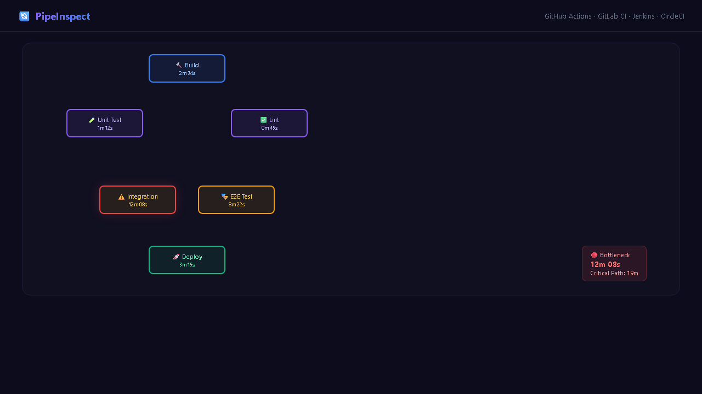

# PipeInspect — CI Pipeline Visualizer and Optimizer

[](LICENSE)
[](https://www.typescriptlang.org/)
[](https://nextjs.org/)

Parses CI configuration files into an interactive DAG. Detects bottlenecks, suggests parallelization opportunities, estimates runner costs, and exports a complexity badge for your README.

## Screenshots

| Landing Page (DAG View) | Analysis (Bottleneck + Cost) |
|:---:|:---:|
|  |

## Features

- Parses GitHub Actions, GitLab CI, Jenkinsfile (declarative), and CircleCI configs
- D3.js force-directed graph with zoom, pan, and click-to-inspect nodes
- Critical path analysis: highlights the longest path through the pipeline
- Bottleneck detection with parallelization suggestions
- Runner-minute cost estimator based on job duration and concurrency
- Execution timeline with historical run durations (requires CI API token)
- Side-by-side comparison of before/after optimization
- SVG complexity badge export for README

## Quick Start

```bash
git clone https://github.com/adlptv/pipeinspect.git
cd pipeinspect
pnpm install
pnpm dev
```

Or:
```bash
docker-compose up
```

## Architecture

```
apps/pipeinspect/
├── src/app/          # Pages: landing, import, visualize, bottlenecks, cost, timeline, compare, analyses, settings
│   └── api/          # parse, analyze, compare, analyses, export-badge, health
├── src/components/   # DagGraph, JobDetail, BottleneckPanel, CostEstimator, Timeline, CompareView, UI primitives
├── src/lib/parsers/  # github-actions, gitlab-ci, jenkinsfile, circleci
├── src/lib/analyzers/# Critical path, bottleneck, cost, complexity scoring
├── prisma/           # SQLite: Analysis
└── tests/            # Vitest + Playwright
```

## Supported CI Formats

- GitHub Actions (workflow YAML)
- GitLab CI (.gitlab-ci.yml)
- Jenkins (declarative pipeline)
- CircleCI (config.yml)

## API

| Method | Endpoint | Purpose |
|--------|----------|---------|
| POST | /api/parse | Parse CI config, return pipeline structure and DAG |
| POST | /api/analyze | Full analysis: bottlenecks, suggestions, cost, complexity |
| POST | /api/compare | Compare two pipeline configs |
| GET/POST | /api/analyses | List or save analyses |
| GET/DELETE | /api/analyses/[id] | Get or delete an analysis |
| GET | /api/export-badge | SVG complexity badge |
| GET | /api/health | Health check |

## Security

- Zod validation on all routes
- Rate limiting
- Helmet.js headers
- Sanitized YAML parsing (no execution of CI config code)

## License

MIT